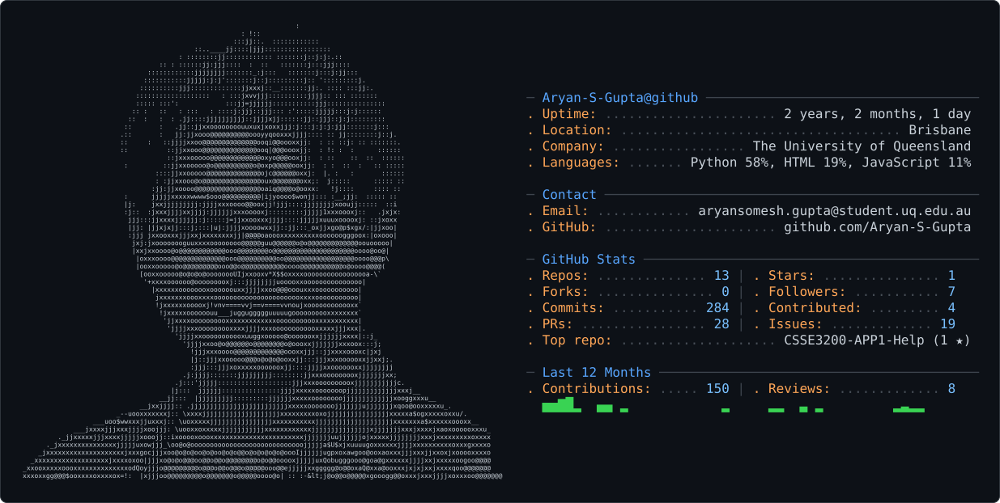

<picture>
  <source media="(prefers-color-scheme: dark)" srcset="dark_mode.svg" />
  <source media="(prefers-color-scheme: light)" srcset="light_mode.svg" />
  
</picture>

# Aryan Somesh Gupta

**Software Engineer · Full-stack development, backend systems & software testing · Brisbane, Australia**

I turn requirements into working software—from client discussions and prototypes to APIs, testing and deployment. I graduated from The University of Queensland with **First Class Honours in Software Engineering** and received the **Dean's Commendation for Academic Excellence in three semesters**.

I currently work as a freelance developer for Yeronga Child Development Centre and a Casual Academic at UQ. I'm looking for graduate and early-career opportunities in software engineering, full-stack development, business analysis and data engineering.

[LinkedIn](https://www.linkedin.com/in/aryansomesh/) · [Email](mailto:aryansomesh123@gmail.com)

## Selected projects

### [DeepFuzz — documentation-driven API testing](https://github.com/Aryan-S-Gupta/DeepFuzz)
My year-long honours thesis under Dr Guowei Yang. Built a Python pipeline that turns API documentation into structured specifications, executable seeds and mutation tests for **JAX, TensorFlow and PyTorch**.

- Processed **1,992 accepted APIs**, producing **1,974 schema-valid specifications** and **12,383 valid test programs** in the saved evaluation runs.
- Implemented validation, isolated execution and reproducible reporting to investigate failures and documentation mismatches.

**Python · LLMs · JSON schema validation · Fuzz testing · Data pipelines**

### [Future of Memory — interactive AI narrative experience](https://github.com/Aryan-S-Gupta/Future-of-Memory)
Led frontend development in a collaborative design-and-build project exploring how people might experience memories in the future.

- Built React gallery and interaction flows, connected frontend views to backend APIs, and added text scaling, text-to-speech and keyboard-accessible controls.
- Iterated through prototypes, team feedback and cross-platform checks; the AI generation backend was a shared team effort.

**React · JavaScript · API integration · Accessibility · Prototyping**

### [Beast Breakout — Java game in a 40+ student studio](https://github.com/Aryan-S-Gupta/Beast-Breakout)
Contributed combat, enemy AI and boss behaviour across **four sprints**, integrating features into a shared Java/LibGDX game.

- Implemented health and damage handling, reusable AI tasks and boss interactions; added tests and resolved integration issues.
- Worked through feature tickets, pull requests and wiki documentation in a large student development team.

**Java · LibGDX · JUnit · Git · Agile delivery**

### [ISIC 2020 — Siamese image classifier](https://github.com/Aryan-S-Gupta/PatternAnalysis-2025)
Developed the Siamese-classifier contribution within this collaborative course repository, using ResNet-50 metric learning, cached embeddings and a lightweight prediction head.

- Recorded **0.903 ROC-AUC** and **79.47% balanced accuracy** in the academic evaluation.
- Used contrastive/triplet learning to learn image representations. This is an academic experiment, not a clinically validated diagnostic tool.

**Python · PyTorch · Representation learning · Model evaluation**

## Client delivery, engineering & teaching

- **Yeronga Child Development Centre:** delivered a React/Supabase (PostgreSQL) website and staff portal, covering requirements, Figma approvals, forms, rostering, role-based access, MFA and Vercel deployment.
- **L&T Technology Services:** translated R&D workflows into a telemetry proof of concept; defined API contracts, built Python/FastAPI endpoints and completed testing, documentation and handover.
- **SpendSmart — team architecture capstone:** worked on authentication, banking-data integration and AWS infrastructure for a React/Flask finance application using PostgreSQL, Cognito, Docker, Terraform and GitHub Actions.
- **UQ Casual Academic:** teach software engineering and software testing; my Semester 2, 2026 classes total **104 enrolments**. Guide teams through requirements, user stories, sprint planning, GitHub workflows, testing and documentation.

## Tools I use

| Area | Tools and methods |
| --- | --- |
| Languages | Python, Java, JavaScript, SQL |
| Applications | React, Flask, FastAPI, Django, PostgreSQL |
| Cloud & delivery | AWS, Docker, Terraform, GitHub Actions |
| Testing & data | pytest, JUnit, PyTorch, scikit-learn, API testing |
| Analysis & design | Requirements gathering, user stories, Figma, usability evaluation, technical documentation |

Currently learning **Power BI and SAP fundamentals**.

Based in Brisbane. **Temporary Graduate visa (subclass 485), valid until 24 July 2029.**
